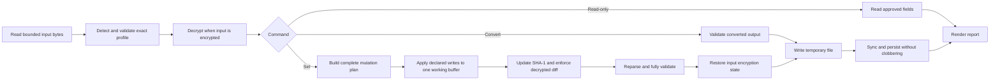

# Rust architecture and porting reference

Status: Proposed  
Date: 2026-08-15

## 1. Design rule

Port confirmed behavior, not Python structure.

The current Python code mixes file I/O, cryptography, offsets, descriptors, mutation, and CLI dispatch. The Rust port must separate these responsibilities. It must preserve unknown bytes and fail before a write when it cannot prove that an operation is safe.

## 2. Current system map

### 2.1 Entry points
Python paths in this section are relative to the parent repository. The Rust project reads them through `../src/kadishutu/` and does not modify them.

| Python path | Responsibility | Port treatment |
| --- | --- | --- |
| `src/kadishutu/main.py` | `argparse` command tree and GUI default | Replace. No implicit GUI. Use an explicit Rust CLI. |
| `src/kadishutu/cli.py` | Decrypt, encrypt, inspect, script, and hash commands | Replace. Do not port reflection or arbitrary Python script loading. |
| `src/kadishutu/editor_cli.py` | DLC, Glory, play time, and Macca edits | Replace with static fields and transactional writes. |
| `src/kadishutu/gui/` | PySide GUI | Do not port in the first stable release. |
| `src/kadishutu/plugin/` | Dynamic Python plug-ins | Do not port until there is a separate product requirement and trust model. |

### 2.2 File and format code

| Python path | Responsibility | Port treatment |
| --- | --- | --- |
| `core/shared/encryption.py` | AES-256-ECB with a fixed 32-byte key | Reimplement behind known-vector tests. Do not infer correctness from round-trip tests alone. |
| `core/shared/file_handling.py` | Read, detect, decrypt, encrypt, SHA-1, and save | Split into envelope, integrity, and atomic I/O modules. Replace assertions with typed errors. |
| `core/shared/editors.py` | Descriptor-based primitive reads and writes | Replace with checked byte readers and typed domain accessors. Do not reproduce mutable descriptor state. |
| `core/shared/unreal.py` | Unreal string parsing | Port only the parts required by a released field. Add strict bounds and encoding errors. |
| `core/shared/unreal_editors.py` | UE header descriptors | Replace with a read-only typed parser before any header writes exist. |
| `core/game_save/game.py` | Top-level offset registry | Use as an inventory. Every field still needs an evidence record. |
| `core/game_save/*.py` | Domain editors | Port by risk tier and invariant, not by file order. |
| `data/*.py` and `data/tables/` | IDs and extracted game metadata | Treat separately from save parsing. Record source game build for each generated table. |

### 2.3 Known defects and risks in the Python implementation

The following observations affect the port plan:

- There is no test or fixture directory in the repository.
- User-facing validation uses Python `assert` in file handling, editors, and domain code. Python can remove assertions with optimization.
- `cmd_encrypt` checks `savefile.is_save_decrypted` without calling it. The bound method is always truthy, so this check does not validate the file state.
- `decrypt` and `encrypt` arguments are declared as required even though command code has a no-destination branch.
- Boolean options use `type=bool`. Common strings such as `false` do not have normal flag semantics.
- The edit command rewrites the input path directly. It has no backup, dry run, or atomic replacement.
- The inspect command traverses arbitrary attributes and mutates a function annotation dictionary when it removes `return`.
- Inspect is documented as broken for properties.
- Script execution imports and executes arbitrary Python from a path.
- Format notes contain many unknown, guessed, and duplicate fields.
- Demon creation is explicitly not recommended because the full demon block is not understood.
- Quest layout uses a structure with unknown bytes. Compendium documentation also contains unknown fields.
- Player and demon stat comments describe game-side recalculation that can revert an edit.
- Item amount and essence metadata appear to be linked.
- Cycles, endings, player names, difficulty, DLC, and summoned state have copies or related values.

These are reasons for independent validation. They are not instructions to make the Rust implementation accept the same states.

## 3. Proposed package layout

Start with one Cargo package. A workspace is not needed until a second independently versioned product exists.

```text
Cargo.toml
src/
  lib.rs
  main.rs
  cli.rs
  crypto.rs
  error.rs
  io.rs
  integrity.rs
  format/
    mod.rs
    detect.rs
    bytes.rs
    game_save.rs
    unreal.rs
  report.rs
tests/
  cli.rs
  corpus.rs
  evidence.rs
  round_trip.rs
```

The package exposes a library and one binary. The binary translates CLI arguments into library operations. It does not contain offsets or mutation logic.

## 4. Core data flow

Stage 3 has this read, conversion, and mutation flow:



A non-`GVAS` input is encrypted only if AES decryption produces the exact approved PC profile with valid structure and SHA-1. Block alignment and file length do not prove encryption. Mutation ownership checks always use decrypted bytes.

## 5. Core types

The names are illustrative. The contracts are required.

```rust
pub enum InputKind {
    Decrypted,
    Encrypted,
    Unrecognized,
}

pub enum FormatProfile {
    SmtVvPcGameSave449680,
}

pub struct SaveDocument {
    profile: FormatProfile,
    bytes: Vec<u8>,
}
```

`SaveDocument` owns one decrypted buffer. Field reads borrow this buffer.

The public API does not expose a mutable save slice. A mutation request produces an immutable plan. The transaction code owns the working buffer and returns owned output bytes only after complete validation.

## 6. Checked byte access

All primitive access must pass through one small checked layer:

- `u8`, `u16_le`, `i16_le`, `u32_le`, and `u64_le`;
- `f32_le`;
- fixed-length bytes, UTF-8 FStrings, and UTF-16LE FStrings;
- checked bit access.

Every function takes a range or offset and returns `Result`. No function can index a save buffer directly outside this layer. Arithmetic must use checked addition and multiplication before a bounds check.

A format profile owns the valid file length and named ranges. Domain code requests a named range. It must not repeat raw offsets across modules.

## 7. Detection and validation

Detection order:

1. Enforce the bounded input length.
2. Test for a decrypted `GVAS` marker at `0x40` without reading out of bounds.
3. Validate a `GVAS` input against the exact profile, UE structure, and SHA-1.
4. For a non-`GVAS` input of the exact supported length, decrypt with AES-256-ECB without padding.
5. Report `encrypted` only if the decrypted result passes the complete profile, structure, and SHA-1 checks.

A valid hash does not prove a valid save. A marker, file length, or AES block alignment also does not prove a valid save. The validator reports the checks on the proved plaintext.

Do not automatically update a bad hash during load or conversion.

## 8. Format profiles

Use one exact profile for the first known GameSave layout. Do not add a generic offset map that silently accepts other lengths.

A profile contains:

- exact accepted lengths;
- required magic values and structural ranges;
- hash range;
- static field definitions;
- field evidence state;
- cross-field invariants;
- platform and game-build evidence.

When a new game build changes a layout, add a new profile only after corpus comparison. Share code only for proven common structures.

## 9. Mutation model

A mutation has four phases:

1. Parse the requested value without changing bytes.
2. Validate its type, range, enum membership, and domain invariants.
3. Produce an exact list of owned byte changes.
4. Apply the changes, update integrity data, and validate the complete document.

A mutation must declare its allowed decrypted ranges. Post-mutation diff code must fail if another range changed. The SHA-1 field is the only implicit changed range. Encryption changes the full ciphertext, so byte-ownership checks use decrypted data.

For a linked field, one semantic operation owns all proven copies. The tool must not expose a partial write for one copy.

## 10. Atomic I/O

Output policy:

- Resolve input and output paths before persistence.
- Reject input and output aliases.
- Reject an existing output.
- Create the temporary file in the destination directory.
- Write all bytes, flush the file, and sync it.
- Persist the temporary file without clobbering another file.
- Preserve the source on every error.
- Remove a temporary file after a handled failure.

`--in-place` is not part of Stage 3. It requires separate backup and atomic replacement tests on Linux, Windows, and macOS.

## 11. Error model

Use one non-exhaustive error enum with source errors. Required classes:

- invalid CLI value;
- I/O;
- cryptographic block length;
- unknown encryption state;
- unsupported format;
- integrity failure;
- truncated range;
- invalid encoding;
- unknown enum value;
- field not supported for read or write;
- invariant violation;
- output or backup collision;
- internal invariant defect.

No user-controlled input path may reach `unwrap`, `expect`, `panic!`, an unchecked index, or an arithmetic overflow.

## 12. CLI architecture

Use a static command and field registry. Each field entry contains:

- stable field ID and CLI path;
- value type;
- read support state;
- write support state;
- display policy for personal data;
- parser and formatter;
- mutation operation, when supported;
- evidence record link.

Text and JSON reports are renderers over the same report structures. Business logic must not print.

The Python `run_script` feature is not part of the Rust core. If automation needs more than JSON and exit codes, add a documented batch format before a plug-in system.

## 13. Port inventory and risk tiers

### Tier 0: Stage 1 foundation

- decrypted-file detection;
- SHA-1 calculation and validation;
- exact profile detection;
- checked read-only byte access;
- bounded UE header parsing;
- read-only validation and field reports.

### Tier 1: evidence-approved read-only fields

- envelope and UE header metadata.

Other fields remain catalog metadata until they reach `confirmed-read`.

Stage 2 implements AES encryption and decryption, proved encrypted-file validation, atomic explicit output, and exact encrypted round trips. Stage 3 implements the transaction boundary and proves it with an internal synthetic field. The internal field is not a supported save field.

### Tier 2: isolated mutations

Candidate fields are Macca, Glory, and play time. Each field stays unavailable to `set` until it reaches `confirmed-write`.

### Tier 3: linked mutations

- names and their copies;
- cycles and endings copies;
- items and essence metadata;
- team order, summoned slots, and summoned-state flags;
- level, experience, stat blocks, and healable values;
- position, map IDs, rotation, and layline.

These features need explicit invariants and state-transition tests.

### Tier 4: incomplete structures

- demon creation;
- compendium mutation;
- quest mutation;
- unknown map and story data;
- SysSave editing.

Do not port these features until format research removes the unknown fields that can affect the operation.

## 14. Data tables

Generated game metadata must record:

- source asset path;
- game platform and build;
- extraction tool and version;
- source file digest;
- generator version;
- generated output digest.

Save parsing must not depend on a display-name lookup. An unknown ID remains a valid numeric observation unless a specific invariant rejects it. A missing name must never block a safe read-only report.

## 15. Compatibility policy

- The CLI schema and field IDs are public interfaces.
- Save format profiles are explicit compatibility units.
- Unknown enum values must be preserved and reported. They must not map to a default value.
- New profiles can share proven parsers, but one profile must not guess another profile's offsets.
- A read-supported field can remain write-disabled.
- Removing unsafe write support is a bug fix, not a compatibility regression.

## 16. Port review checklist

For each Python feature:

1. Identify all bytes that the Python code reads and writes.
2. Identify all format notes and uncertainty markers for those bytes.
3. Collect real before-and-after save pairs.
4. State the semantic invariant and accepted value range.
5. Confirm behavior without using Python as the only oracle.
6. Add primitive, corpus, differential, and in-game tests as applicable.
7. Add the field to the static registry only after its release gate passes.
8. Remove or reject Python behavior that cannot pass the gate.
